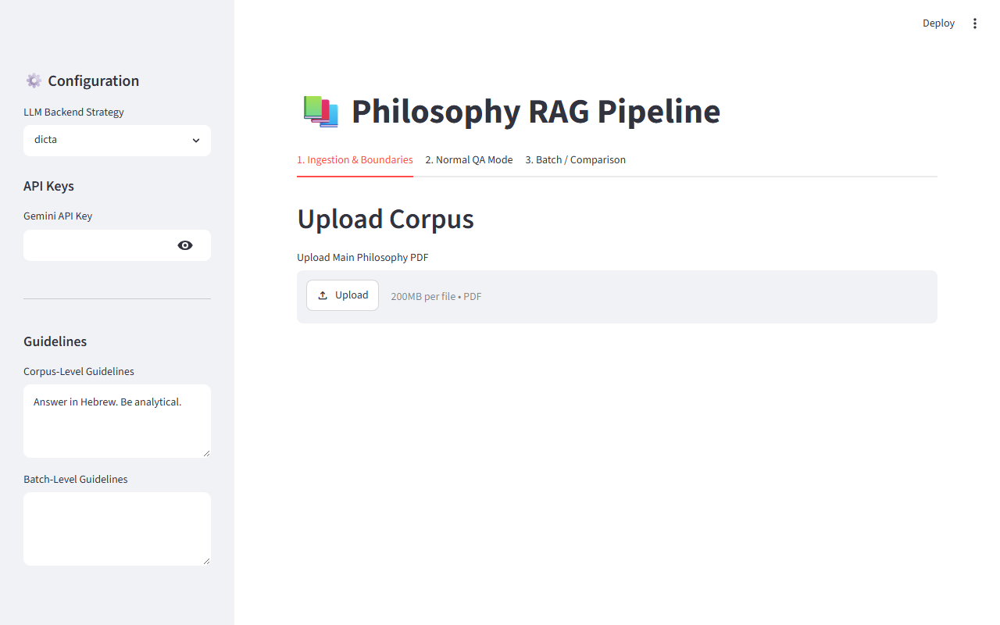
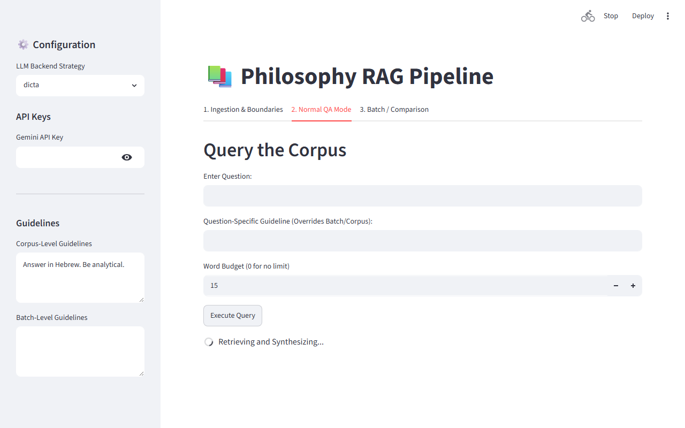
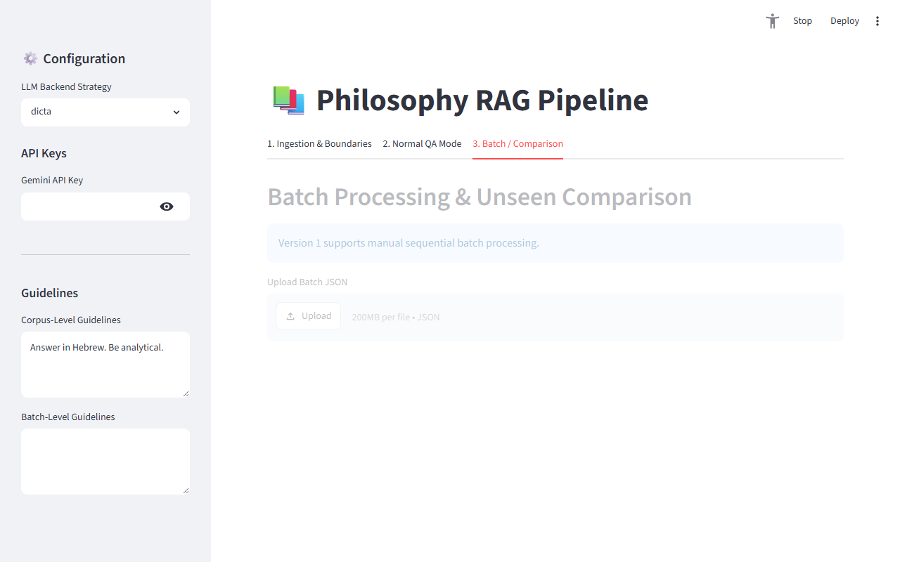

# Philosophy RAG System: Operator Guide

Welcome to the Philosophy RAG System. This application is designed for researchers and operators who need to search large, complex bilingual (Hebrew/English) philosophy texts and extract targeted, strictly-grounded answers. 

Every answer generated by this system is backed by a specific paragraph in your uploaded text, complete with an exact page citation.

---

## ⚡ Quickstart

If you want to start asking questions immediately, follow these 5 steps:
1. **Launch the app:** Run `py -m streamlit run src/app.py` in your terminal.
2. **Configure AI:** In the left sidebar, choose **gemini** and paste your API key.
3. **Upload Corpus (Tab 1):** Upload your PDF, click **Detect Boundaries**, and then click **Approve & Split Corpus**.
4. **Ask Question (Tab 2):** Go to the "Normal QA Mode" tab, type your question in Hebrew, and click **Execute Query**.
5. **View Evidence:** Read the answer and click the "Show Retrieved Evidence & Citations" dropdown below it to verify the source text.

---

## 1. Launching the App
To start the application, open your terminal (PowerShell or Command Prompt), navigate to the project folder, and run:
```powershell
py -m streamlit run src/app.py
```
This will automatically open a new tab in your default web browser (usually at `http://localhost:8501`).

---

## 2. Choosing Your AI Backend
In the left sidebar, you must select which AI model processes your documents.

*   **gemini:** Choose this if you want fast, cloud-hosted processing. *Requires pasting a valid Google Gemini API Key into the sidebar.*
*   **dicta:** Choose this if you require strict data privacy and want the processing done locally on your machine using a Hebrew-specialized model. *Requires a high-end computer with a dedicated GPU (e.g., CUDA with 14GB+ VRAM).*
*   **auto:** Choose this if you want the system to attempt using local DICTA first, but automatically switch to Gemini if your local hardware cannot handle it.

---

## 3. Step-by-Step Workflow

### Step 1: Uploading the Corpus
Go to **Tab 1: Ingestion & Boundaries**. This is where you build your searchable knowledge base.


*Caption: The main layout showing the Corpus upload area.* 
**What to notice:** The left sidebar holds your critical backend settings. Always configure your AI backend here before running a query.

1. Upload your main philosophy PDF.
2. (Optional) Upload a `.txt` file containing a list of article titles. This drastically improves how the system splits the book into logical sections.
3. Click **Detect Boundaries**.

### Step 2: Reviewing Boundaries
Once boundaries are detected, a data table will appear on the screen.
1. Review the table. It lists every detected article, its Title, and its Start/End pages.
2. If the system made a mistake, double-click directly on a Title or Page Number in the table to fix it.
3. When you are satisfied, click **Approve & Split Corpus**. *Wait for the green success message before moving on.*

### Step 3: Asking Questions
Go to **Tab 2: Normal QA Mode**.


*Caption: The primary QA interface.*
**What to notice:** Notice the red error banner under the Execute button. This appears if you try to use Gemini but forgot to paste your API key in the sidebar.

1. Type your question in the main text box.
2. **(Optional) Question-Specific Guideline:** Enter rules like *"Do not mention Aristotle"* or *"Focus only on ethics."*
3. **(Optional) Word Budget:** Set a strict maximum word count. The AI will force itself to summarize if it exceeds this limit.
4. Click **Execute Query**.

### Step 4: Reviewing Answers and Evidence
When the AI finishes thinking, two things will appear on your screen:
1. **The Answer:** A strict Hebrew response containing inline citations (e.g., `[Article Title, p. 12]`).
2. **The Evidence Section:** An expandable drawer below the answer. Click this drawer to read the exact, raw text paragraphs the system pulled from your PDF to formulate its answer.

### Step 5: Exporting Results
At the bottom of Tab 2, click the **Download JSON** button to save a permanent record of your question, the rules applied, the exact evidence used, and the final answer.

---

## 4. Working with Unseen Articles (Comparison Mode)
If you have a new article that is *not* in your main PDF, and you want to compare its ideas against your entire corpus, go to **Tab 3: Batch / Comparison Mode**.


*Caption: The Batch processing and Comparison tab.*
**What to notice:** This tab allows you to upload JSON files to queue up dozens of questions at once, or upload a completely new PDF for comparative analysis.

1. Upload the new article PDF.
2. The system will build a temporary index for this article (leaving your main corpus untouched).
3. Execute the comparison query. The output will be a highly structured report listing Agreements, Contradictions, and Differences.

---

## 5. Understanding Warnings and Errors

The UI features prominent colored banners to alert you if something goes wrong.

### 🔴 Missing Gemini API Key (Error)
*   **What it means:** The system blocked your question from running.
*   **Why it happened:** You selected `gemini` in the sidebar, but left the API Key box empty.
*   **What to do:** Paste your API key into the sidebar and click Execute again.

### 🟡 Budget Failed (Warning)
*   **What it means:** The generated answer is longer than you requested.
*   **Why it happened:** You set a Word Budget that was too small (e.g., 5 words) for a complex philosophical concept. The AI tried to shrink the answer twice but failed.
*   **What to do:** The answer is still provided for you to read, but if you need it shorter, increase your Word Budget to a more reasonable number and try again.

### 🟡 Weak Evidence (Warning)
*   **What it means:** The AI refused to answer the question.
*   **Why it happened:** The retrieved paragraphs from the PDF did not contain the information needed to answer your question.
*   **What to do:** This is a feature, not a bug! The system is programmed to admit ignorance rather than hallucinate a fake answer. Try rephrasing your question or uploading a different PDF.

---

## 6. Troubleshooting

*   **"Index not found" error when querying:** You forgot to click **Approve & Split Corpus** on Tab 1. You must approve the boundaries before you can ask questions.
*   **The app takes a very long time to answer:** If you selected the `dicta` backend, the system relies on your local computer's hardware. Complex queries take time. If it is too slow, switch to `gemini`.
*   **I uploaded a new PDF, but the answers are from the old PDF:** When you upload a new Main PDF, you *must* click **Approve & Split Corpus** again to overwrite the old search index.

*Note: This app does not stream words to the screen one-by-one like ChatGPT. You will see a loading spinner until the final, verified, word-counted answer is ready.*
